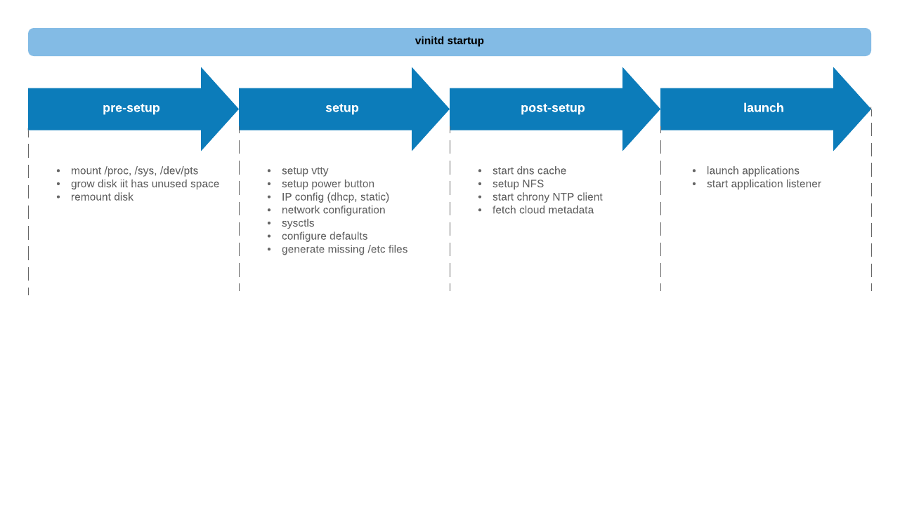

<br />
<p align="center">
  <a href="https://github.com/vorteil/vinitd">
    
  </a>
  <h3 align="center">vinitd - vorteil.io init</h3>
  <h5 align="center">vorteil.io init</h5>
</p>
<hr/>

Vinitd is the init process for [vorteil.io micro virtual machines](https://github.com/vorteil/vorteil). It manages the configuration of the environment and the applications on the instance. For more documentation:

* The [Vorteil.io tools](https://github.com/vorteil/vorteil) project.
* The Vorteil [documentation](https://docs.vorteil.io/).
* The free Vorteil [apps repository](http://apps.vorteil.io/).
* The Vorteil [blog](https://blog.vorteil.io/).
* The [Godoc](https://godoc.org/github.com/vorteil/vorteil) library documentation.

### Architecture

Vinitd is a small but feature-complete init for small virtual machines which can be found at _/vorteil/vinitd_ on vorteil images. It is a purpose-built and and requires a specific disk-layout build by [vorteil's tools](https://github.com/vorteil/vorteil).

#### Stages

Vinitd runs through four stages starting with low level tasks like setting up stdout, network and logging. In the last stage the configured applications are getting launched. Should an error occur during one of the stages vinitd stops the virtual machine.

<p align="center">
    
</p>

##### Pre-Setup

* Basic vtty setup
* Creates _/tmp_ if it does not exist
* Mount _/proc, /sys, /dev/pts_
* Init _/proc/self/fd_

##### Setup

* Read VCFG configuration from disk
* Setup vtty based on VCFG
* Setup signals for poweroff, reboot
* Configure power button
* DHCP / static IP
* Configure routes
* Setup shared memory
* Run sysctls and defaults
* Setup fake users
* Create /etc files if required

##### Post Setup

* Start DNS cache
* Mount NFS
* Enable fluentbit logging
* Add cloud environment variables (EXT_IP etc.)
* Start chronyd if NTP provided

##### Launch

* Launch applications
* Launch strace if configured
* Start application listener

### Building

To build and test changes in vinitd it needs to be part of a bundle. To make this process easier there is a dedicated make target available to build a bundle with the newly build vinitd.

```sh
make BUNDLE=20.9.2 VERSION=88.88.1 TARGET=/tmp bundle
```

The variables to provide are:

* BUNDLE: Base used for the new bundle. Can be any bundle from vbundlerthe [releases page](https://github.com/vorteil/vbundler/releases).
* VERSION: Version of the new bundle. Needs to have the following format XX.XX.X
* TARGET: The target directory for the new bundle. After a successful build there will be a file _`kernel-$VERSION`_ in that directory.

### License

Distributed under the Apache 2.0 License. See `LICENSE` for more information.

### Acknowledgements

* [dnsproxy](https://github.com/Asphaltt/dnsproxy-go)
* [dhcp](https://github.com/insomniacslk/dhcp)
