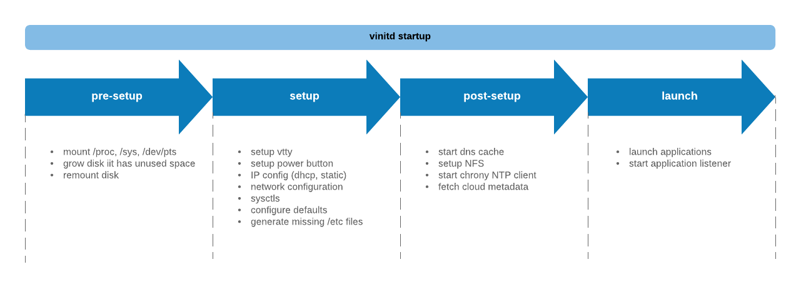

<br />
<p align="center">
  <a href="https://github.com/vorteil/vinitd">
    
  </a>
  <h3 align="center">vinitd</h3>
  <h5 align="center">vorteil.io init</h5>
</p>
<hr/>

Vinitd is the init process for [vorteil.io virtual machines](https://github.com/vorteil/vorteil). It manages the configuration of the environment and the applications on the instance. For more documentations: [TODO DOCS]()

## Table of Contents

* [Architecture](#architecture)
* [Building](#building)
* [Contributing](#contributing)
* [License](#license)
* [Acknowledgements](#acknowledgements)

### Architecture

Vinitd is a small but feature-complete init for small virtual machines which can be found at _/vorteil/vinitd_ on vorteil images. It requires the vorteil disk-layout which is gettting build with [vorteil tools](https://github.com/vorteil/vorteil).

#### Disk Layout

#### Phases

During runtime vinitd completes four phases before it launches the applications. If a failure in one of those phases occurs the virtual machine will be stopped.

<p align="center">
    
</p>

##### Pre-Setup

##### Setup

##### Post Setup

##### Launch

### Building

This project is getting build during the bundle process of [vbundler](https://github.com/vorteil/vbundler) and has dedicated targets for building and updating _vinitd_ ('make dev-vinitd' in [vbundler](https://github.com/vorteil/vbundler)). This is the preferred method.

Nevertheless this project can be build standalone as well:

```sh
git clone https://github.com/vorteil/vinitd
cd vinitd
make
```


### License

Distributed under the Apache 2.0 License. See `LICENSE` for more information.

### Acknowledgements

* [dnsproxy](https://github.com/Asphaltt/dnsproxy-go)
* [dhcp](https://github.com/insomniacslk/dhcp)
